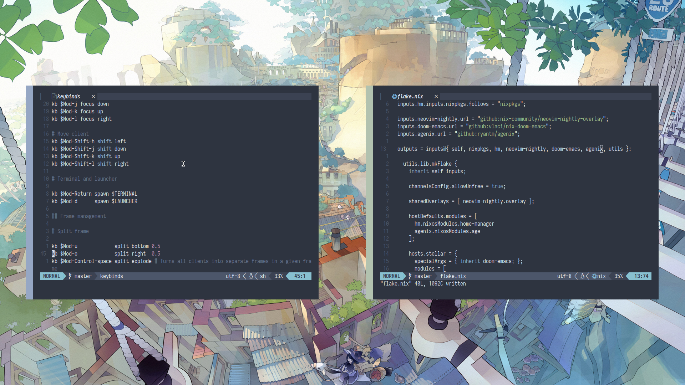
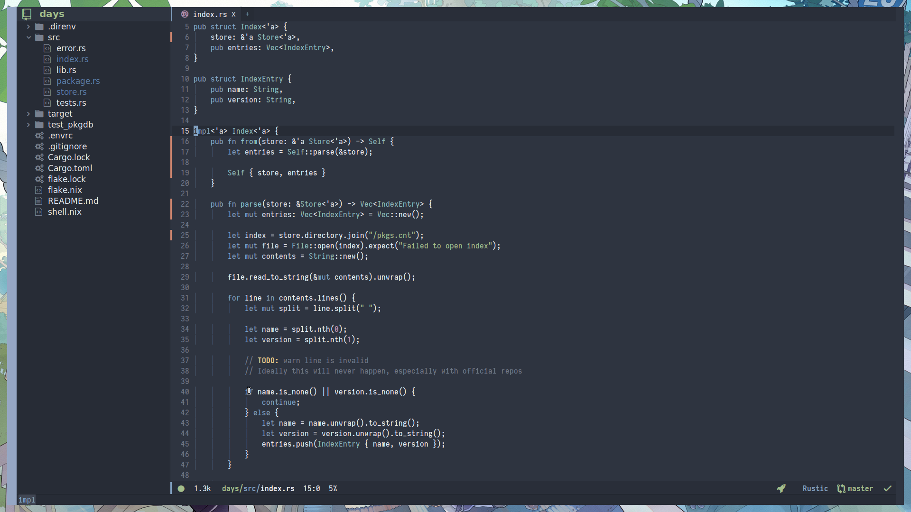

# Rain's .dotfiles

My personal (NixOS) configuration that is an absolute mess, do not do what I do

Information
-----------

- WM: Herbstluftwm
- Terminal: Alacritty
- Editor: nvim

Programs:
- Neovim
  - Mainly used for config editing, or stuff where it'd be unreasonable to use emacs
- (Doom) Emacs
  - Used for working on actual (useless) projects
- Ncmpcpp
  - Used as a front-end for MPD (Music Player Daemon)

Running:
- MPD (Music Player Daemon)
- Jellyfin (Media Server)

TODO
----
- [ ] Convert more to nix
  - [ ] Neovim
  - [ ] Emacs
  - [X] Ncmpcpp
- [ ] Refactor/clean up modules

Screenshots
-----------
> TODO: Add more screenshots

"Busy":

Doom Emacs:

